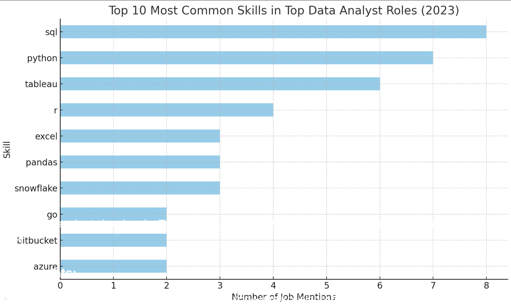

# Introduction
  Dive into the data job market! Focusing on data analyst roles, this project explores, 💰 top-paying jobs, in-demand 📈 where high demand meets high salary in data analytics. 

  🔍 SQL queries? Check them out here: [project_sql folder](/project_sql/)

# Background
Drive by a quest to navigate the data analyst job market more effectively, this project was born from a desire to pinpoint top-paid and in-demand skills, streamlining others work to find optimal jobs.

Data hails from [SQL Course](https://www.youtube.com/watch?v=7mz73uXD9DA&t=14294s). It's packed with insights on job titles, salaries, locations, and essential skills.

### The question I wanted to answer through my SQL queries were:

1. What are the top-paying data analyst jobs?
2. What skills are required for these top-paying jobs?
3. What skills are most in demand for data analysts?
4. Which skills are associated with higher salaries?
5. What are the most optimal skills to learn?

# Tools I used

For my deep dive into the data analyst job market, I harnessed the power of several key tools:

- **SQL**: The backbone of my analysis, allowing me to query the database and unearth critical insights.
- **PostgresSQL**: The chose database management system, ideal for handling the job posting data. 
- **Visual Studio Code**: My go-to for database management and executing SQL queries.
- **Git & GitHub**: Essential for version control and sharing my SQL scripts and analysis, ensuring collaboration and project tracking.

# The Analysis

Each query for this project aimed at investigating specific aspects of the data analyst job market. Here's how I approached each questions:

### 1. Top Paying Data Analyst Jobs
To identify the highest-paying roles, I filtered data analyst positions by average yearlr salary and locaiton, focusing on remote jobs. This query highlights the high paying opportunities in the field.

```sql
SELECT
    job_id,
    job_title,
    job_location,
    job_schedule_type,
    salary_year_avg,
    job_posted_date,
    name AS company_name
FROM 
    job_postings_fact
LEFT JOIN company_dim ON job_postings_fact.company_id = company_dim.company_id
WHERE
    job_title_short = 'Data Analyst' AND
    job_location = 'United States' AND
    salary_year_avg IS NOT NULL
ORDER BY
    salary_year_avg DESC
LIMIT 10;
```
Here's the breakdown of the top data analyst jobs in 2023:
- **Wide Salary Range:** Top 10 paying data analyst roles span from $184,000 to $650,000, indicating significant salary potential in the field.
- **Diverse Employers:** Companies like SmartAssest, Meta, and AT&T are among those offering high salaries, showing a broad interest across different industries.


*Bar graph visualizing the salary for the top 10 salaries for data analysts; ChatGPT generated this graph from my SQL query results*

### 2. Skills For Top Paying Jobs
To understand what skills are required for the top-paying jobs, I joined the job postings with the skills data, providing insights into what employers value for high-compensation roles.

```sql
WITH top_paying_jobs AS (
    SELECT
        job_id,
        job_title,
        salary_year_avg,
        name AS company_name
    FROM 
        job_postings_fact
    LEFT JOIN company_dim ON job_postings_fact.company_id = company_dim.company_id
    WHERE
        job_title_short = 'Data Analyst' AND
        job_location = 'United States' AND
        salary_year_avg IS NOT NULL
    ORDER BY
        salary_year_avg DESC
    LIMIT 10
)

SELECT 
    top_paying_jobs.*,
    skills
FROM top_paying_jobs
INNER JOIN skills_job_dim ON top_paying_jobs.job_id = skills_job_dim.job_id
INNER JOIN skills_dim ON skills_job_dim.skill_id = skills_dim.skill_id
ORDER BY
    salary_year_avg DESC
LIMIT 5;
```
### Here's the breakdown of the most demanded skills for the top 10 highest paying data analyst jobs in 2023:
- SQL is leading with a bold count of 8.
- Python follows closely with a bold count of 7.
- Tableau is also highly sought after, with a bold count of 6. Other skills like R, Snowflake, Pandas, and Excel show varying degrees of demand.



*Bar graph visualizing the count of skills for the top 10 paying jobs for data analysts; ChatGPT generated this graph from my SQL query results*

### 3. In-Demand Skills for Data Analysts
This query helped identify the skills most frequently requested in job postings, directing focus to areas with high demand.

```sql
SELECT 
    skills,
    COUNT(skills_job_dim.job_id) AS demand_count
FROM job_postings_fact
INNER JOIN skills_job_dim ON job_postings_fact.job_id = skills_job_dim.job_id
INNER JOIN skills_dim ON skills_job_dim.skill_id = skills_dim.skill_id
WHERE 
    job_title_short = 'Data Analyst' AND
    job_work_from_home = True 
GROUP BY
    skills
ORDER BY
    demand_count DESC
LIMIT 5;
```
| Skills     |  Demand Count  |
|------------|----------------|
| SQL        |  7291          |
| Excel      |  4611          |
| Python     |  4330          |
| Tableau    |  3745          |
| Power BI   |  2609          |

*Table of the demand for the top 5 skills in data analyst job postings*

### 4. Skills Based on Salary
Exploring the average salaries associated with different skills revealed which skills are the highest paying.

```sql
SELECT 
    skills,
    ROUND(AVG(salary_year_avg), 0) AS avg_salary
FROM job_postings_fact
INNER JOIN skills_job_dim ON job_postings_fact.job_id = skills_job_dim.job_id
INNER JOIN skills_dim ON skills_job_dim.skill_id = skills_dim.skill_id
WHERE 
    job_title_short = 'Data Analyst' 
    AND salary_year_avg IS NOT NULL
    AND job_work_from_home = True
GROUP BY
    skills
ORDER BY
    avg_salary DESC
LIMIT 25;
```

Here's a breakdown of the results for top paying skills for Data Analysts:

- Pyspark leads the pack by a solid margin, aligning with demand for scalable data processing in big data engineering.
- Several AI/ML-related tools like Watson and DataRobot also rank highly, showing the premium value placed on machine learning engineering.
- DevOps & Source Control tools like Bitbucket also crack the top, highlighting the intersection of data science and modern software engineering practices.

| Skills         |  Average Salary ($)|
|----------------|--------------------|
| pyspark        |  208,172
| bitbucket      |  189,155
| couchbase      |  160,515
| watson         |  160,515
| datarobot      |  155,486
| gitlab         |  154,500
| swift          |  153,750
| jupyter        |  152,777
| pandas         |  151,821
| elasticsearch  |  145,000

### 5. Most Optimal Skills to learn
Combining insights from demand and salary data, this query aimed to pinpoint skills that are both in high demand and have high salaries, offering a strategic focus for skill development.

```sql
SELECT
    skills_dim.skill_id,
    skills_dim.skills,
    COUNT(skills_job_dim.job_id) AS demand_count,
    ROUND(AVG(job_postings_fact.salary_year_avg), 0) AS avg_salary
FROM job_postings_fact
INNER JOIN skills_job_dim ON job_postings_fact.job_id = skills_job_dim.job_id
INNER JOIN skills_dim ON skills_job_dim.skill_id = skills_dim.skill_id
WHERE
    job_title_short = 'Data Analyst'
    AND salary_year_avg IS NOT NULL
    AND job_work_from_home = TRUE
GROUP BY
    skills_dim.skill_id
HAVING 
    COUNT(skills_job_dim.job_id) > 10
ORDER BY
    avg_salary DESC,
    demand_count DESC
LIMIT 25;
```
| Skill ID | Skills      | Demand Count | Average Salary ($) | 
|----------|-------------|--------------|--------------------|
| 8        | go          | 27           | 115320
| 234      | confluence  | 11           | 114210
| 97       | hadoop      | 22           | 113193
| 80       | snowflake   | 37           | 112948
| 74       | azure       | 34           | 111225
| 77       | bigquery    | 13           | 109654
| 76       | aws         | 32           | 108317
| 4        | java        | 17           | 106906
| 194      | ssis        | 12           | 106683 
| 233      | jira        | 20           | 104918

*Table of the most optimal skills for data analyst sorted by salary*

Here's a breakdown of the most optimal skills for Data Analysts in 2023:
- Go (a programming language) leads in salary influence, but isn’t the most in-demand.
- Snowflake, Azure, and AWS are highly paid and widely demanded, showing great ROI.
- Tools like Confluence and Jira also have high salary associations—possibly due to their importance in team collaboration/project environments.

# What I Learned 

Throughout this project, I've advanced my SQL skills and presentation of the project:

- **Complex Query Crafting:** Learned to use advanced SQL, merging tables with ease.
- **Data Aggregation:** Got comfortable with GROUP BY and aggregation functions like COUNT() and AVG() 
- **Analytical Skills** Leveled up my real-worl problem-solving skills, turning questions into actionable insights SQL queries.

# Conclusions 

### Insights
From the analysis, several general insights emerged:

1. **Top-Paying  Data Analyst Jobs**: The Research Scientist and Research Engineers are the highest paid, then comes the Director, Data Analytics, Clinical Scientist, they get offered a wide range of salaries, the highest at $650,000!
2. **Skills for Top-Paying Jobs**: High-paying data analyst jobs require advanced proficiency in SQL, suggesting it's a critical skill fro earning a top salary.
3. **Most In-Demand Skill**: SQL is the most demanded skill in the data analyst job market.
4. **Skills with Higher Salaries**: pyspark is the skill which gets paid highest as up to $208,172.
5. **Optimal Skills for Job Market Value**: Go (a programming language) leads in salary influence, but isn’t the most in-demand.
Snowflake, Azure, and AWS are highly paid and widely demanded, showing great ROI.

### Closing Thoughts

This was my first project, guided by Luke Barousse. This thought me essential SQL skills required for a Data Analyst. Got to learn Postgres SQL, setting up GitHub profile and commiting my files on GitHub. 
Overall, this project thought me basics to adavanced SQL necessary for Analysing Data, how to present the project, and how to solve the real world problems. 